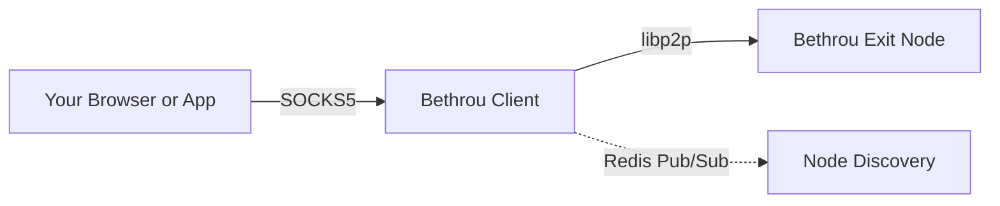

# Bethrou

**A simple peer-to-peer proxy network**

---

## 📚 Documentation

**[Read the full documentation →](https://bethrou.github.io/)**

This README provides a quick overview. For comprehensive guides, tutorials, and API references, visit our [documentation site](/https://bethrou.github.io/).

## What is Bethrou?

Bethrou is a **peer-to-peer proxy network** that allows you to route your internet traffic through trusted exit nodes using a private network built on [libp2p](https://libp2p.io/).

### Key Features

- **Private Networks**: Uses pre-shared keys (PSK) for network isolation
- **P2P Architecture**: Built on libp2p for robust peer-to-peer communication
- **SOCKS5 Proxy**: Local SOCKS5 server for easy browser/application integration
- **NAT Traversal**: Support for relay nodes to handle NAT and firewall issues
- **Node Discovery**: Redis-based pub/sub for dynamic node discovery
- **Load Balancing**: Multiple routing strategies (random, round-robin, fastest)

## How It Works

1. **Client** starts and loads exit node addresses (static or via discovery)
2. **Client** creates a SOCKS5 proxy server on `localhost:1080`
3. Applications connect to the SOCKS5 proxy
4. **Client** establishes libp2p connections to exit nodes
5. Proxy requests are forwarded through libp2p streams to exit nodes
6. **Exit nodes** make actual TCP connections to destination addresses
7. Traffic flows: `App → SOCKS5 → libp2p → Exit Node → Internet`

## Use Cases

- **Privacy**: Route traffic through trusted nodes you control
- **Testing**: Test applications from different network locations
- **Development**: Create isolated network environments for testing
- **Learning**: Understand P2P networking and libp2p architecture

## Getting Started

To get started with Bethrou, visit our comprehensive documentation:

- **[Quick Start Guide](https://bethrou.github.io/docs/getting-started/quick-start)** - Installation, configuration, and running your first proxy
- **[Local Deployment Guide](https://bethrou.github.io/docs/guides/deployment-local)** - Deploy Bethrou directly from code

Our documentation covers:

- Prerequisites and installation options (source build, Docker, Podman)
- Generating and managing network keys
- Configuring nodes and clients
- Running example setups
- Troubleshooting and best practices

## Contributing

This is an early-stage project. Contributions, ideas, and feedback are welcome!

## License

MIT License - see LICENSE file for details
